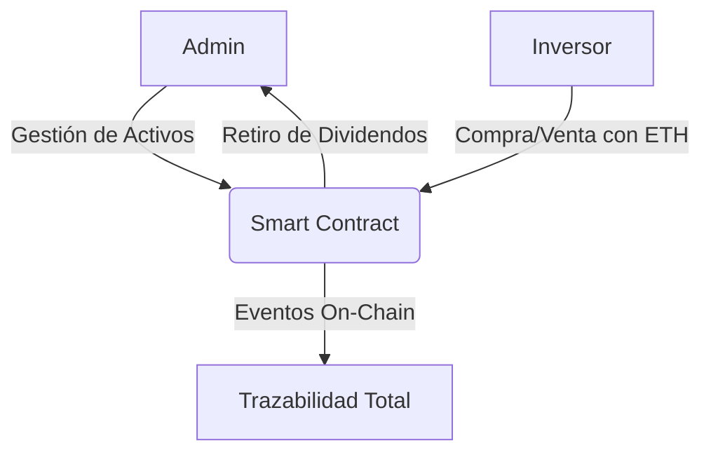

# 🌐 AssetRegistry: Gestión de Activos Financieros Tokenizados

  
  
  
  

`AssetRegistry` es un ecosistema de inversión descentralizado desarrollado en **Solidity 0.8.20**. Permite la tokenización, compra y venta de activos financieros mediante Smart Contracts, garantizando transparencia y trazabilidad absoluta en cada operación.

---

## 💎 Características Principales

*   **Tokenización de Activos**: Registro y gestión de fondos, acciones y bonos on-chain.
*   **Trading Descentralizado**: Motor de intercambio directo mediante Ether sin intermediarios.
*   **Seguridad Bancaria**: Aplicación de estándares de seguridad como *Checks-Effects-Interactions*.
*   **Auditoría en Tiempo Real**: Trazabilidad completa mediante eventos blockchain.
*   **Gestión Administrativa**: Panel de control robusto para la gestión de activos y liquidez.

---

## 📂 Documentación Técnica

Para un análisis profundo del contrato, sus métodos y lógica interna, consulta nuestra documentación detallada:

👉 **[DOCUMENTATION.md](./DOCUMENTATION.md)**
*   *Desglose de funciones administrativas y transaccionales.*
*   *Estructuras de datos y mappings.*
*   *Análisis de medidas de seguridad y eventos.*

---

## 🚀 Guía de Operación Rápida

### 1. Despliegue
1. Carga `smartContract.sol` en [Remix IDE](https://remix.ethereum.org/).
2. Compila con la versión `0.8.20`.
3. Despliega en **Remix VM (Cancun)**.

### 2. Flujo de Trabajo
1.  **Administrador**: Crea activos mediante `addAsset` y gestiona su precio/stock.
2.  **Inversor**: Adquiere activos con `buyAsset` (enviando ETH) o los liquida con `sellAsset`.
3.  **Auditoría**: Consulta balances en tiempo real mediante las funciones `view`.

---

## 📊 Arquitectura Visual

---

---
> ⚠️ **Este proyecto es de carácter académico y no está destinado a producción ni uso financiero real.**
